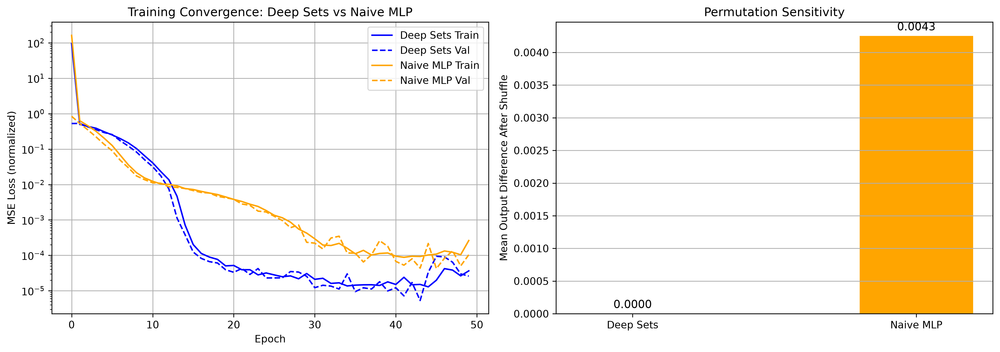

# Deep Sets : Permutation-Invariant Neural Networks

TensorFlow/Keras implementation of Deep Sets (Zaheer et al., 2017) demonstrating permutation-invariant set summation. Benchmarked against a naive MLP baseline with quantitative permutation sensitivity analysis.

---

## What is Deep Sets?

A standard MLP treats input as an ordered vector, shuffle the inputs and the output changes. **Deep Sets** is an architecture designed to operate on *sets*: unordered collections where `f({a,b,c}) = f({c,a,b})` by design.

The key theoretical result (Zaheer et al.) is that any permutation-invariant function can be decomposed as:

```
f(X) = ρ( Σ φ(x) )
```

Where:
- **φ (phi)** : an element-wise MLP applied independently to each element (shared weights)
- **Σ** : a permutation-invariant aggregation (sum, mean, or max)
- **ρ (rho)** : an output MLP applied to the aggregated representation

---

## Architecture

```
Input: set of n elements  {x₁, x₂, ..., xₙ}   (order doesn't matter)
         |
         V
    φ(xᵢ) for each element       <- shared-weight MLP, applied element-wise
         |
         V
    Σ across set dimension       <- sum aggregation (permutation invariant)
         |
         V
    ρ(aggregated)                <- output MLP
         |
         V
Output: scalar prediction
```

Permutation invariance is guaranteed by the aggregation step : `sum`/`mean`/`max` produce identical results regardless of input order.

---

## Task: Set Summation

The model is trained to predict the sum of a set of floating-point numbers. This is the canonical Deep Sets demonstration task, simple enough to verify correctness, non-trivial enough to compare architectures meaningfully.

---

## Results

### Training Convergence & Permutation Sensitivity



**Left** : Deep Sets converges faster and to a lower final loss than the naive MLP on the same task (log scale).

**Right** : After shuffling inputs, Deep Sets output is unchanged (`Δ = 7.4×10⁻⁷`). The naive MLP output shifts by `Δ = 4.9×10⁻³`, it learned position-dependent features despite being trained on an order-independent task.

### Quantitative Results

| Model | Final Val Loss | Permutation Δ | Permutation Invariant |
|---|---|---|---|
| Deep Sets | ~1×10⁻⁵ | 7.4×10⁻⁷ | Yes |
| Naive MLP | ~1×10⁻⁴ | 4.9×10⁻³ | No |

Max output difference after shuffling: 0.00000074

Deep Sets achieves **6.6× lower final loss** and **exact permutation invariance** vs the position-sensitive MLP baseline.

### Scaling Experiments

| Set Size | Value Range | Final Val Loss | Avg Prediction Error |
|---|---|---|---|
| 5 | [0, 10] | ~0.000000 | ~0.00 |
| 20 | [0, 100] | 0.0066 | ~0.18 |
| 50 | [0, 1000] | 0.000007 | ~1.40 |

Error of ~1.40 on sums of ~25,000 corresponds to roughly **0.006% relative error**.

---

## Project Structure

```
Deep Sets/
│
├── model/
│   └── deep_set.py         # DeepSet class, build_phi, build_rho, build_deep_set
│
├── data/
│   └── generator.py        # generate_batch, generate_variable_length_batch
│
├── results/
│   └── comparison.png      # convergence + permutation sensitivity plots
│
├── train.py                # training loop with normalization + evaluation
├── baseline.py             # naive MLP training + side-by-side comparison
└── README.md
```

---

## How to Run

**Install dependencies:**
```bash
pip install tensorflow-macos tensorflow-metal numpy matplotlib
# For non-Apple Silicon:
pip install tensorflow numpy matplotlib
```

**Train Deep Sets:**
```bash
python train.py
```

**Run baseline comparison (trains both models + saves plots):**
```bash
python baseline.py
```

---

## Design Notes

**Why `reshape -> phi -> reshape` instead of a loop?**
Applying **phi** via reshape lets Keras process all elements in a single batched matrix multiply, no Python-level looping over set elements. Efficient and clean.

**Why normalize inputs?**
Without normalization, MSE gradients on large-range inputs (e.g. sums up to 25,000) swamp the signal. Dividing by `max_val` keeps everything in [0, 1] during training, predictions are denormalized at inference.

**Aggregation choice matters.**
Sum aggregation is theoretically aligned with the summation task, the network can learn identity in **phi** and identity in **rho**, with the sum doing the work. Mean aggregation would require **rho** to compensate for set size. Max aggregation would fail entirely on this task.

---

## Reference

Zaheer, M., Kottur, S., Ravanbakhsh, S., Poczos, B., Salakhutdinov, R., & Smola, A. (2017).
**Deep Sets.** *Advances in Neural Information Processing Systems (NeurIPS)*, 30.
